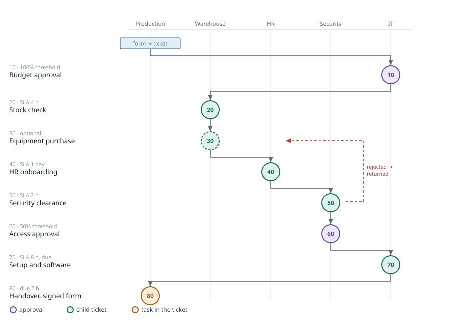
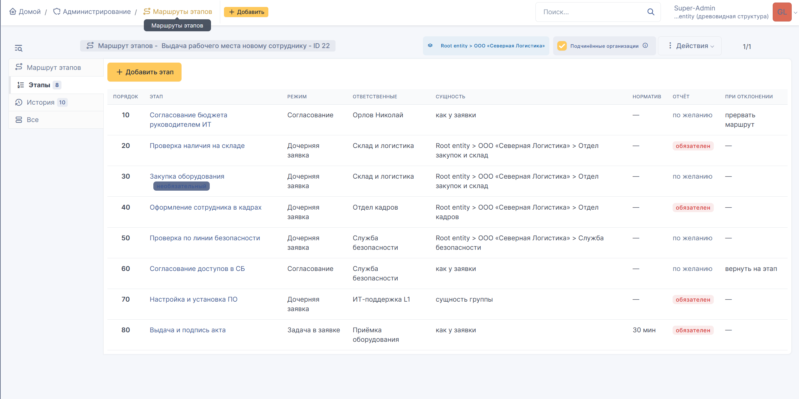
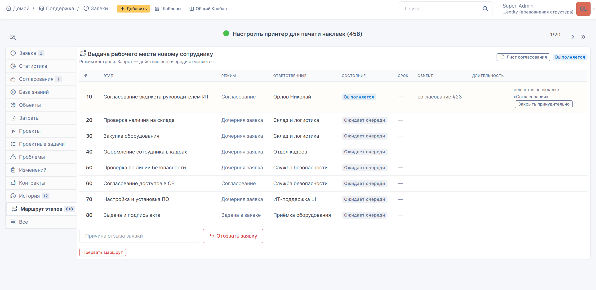
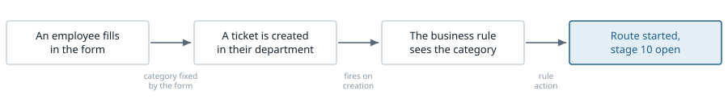

# itilflow — staged routes for ticket handling in GLPI 11

English · **[Русский](README.md)**

A GLPI 11 plugin that makes a ticket follow a defined procedure: stage by stage,
in a fixed order, across the departments that must be involved — and refuses to
let the ticket close until the procedure is complete.

> **Language notice.** The plugin's user interface is **Russian only**. Strings
> are hardcoded and there is no translation catalogue, so no English locale
> exists at this time. This document describes what the plugin does; the screens
> your users will see are in Russian. See [Limitations](#limitations).

---

## Why this exists

GLPI has tasks, child tickets and approvals. What it does not have is **order**.
Nothing stops a technician from resolving a ticket while skipping the security
review; nothing reminds anyone that a new hire must be registered with HR before
the laptop is handed over; and no built-in report answers the question "which
stage do our tickets get stuck at, and for how long?"

The classic example is **provisioning a workstation for a new employee**. The
process crosses five departments:

```
budget approval → stock check → HR onboarding
    → security clearance → setup and software → handover against a signed form
```

Without a route this is either one ticket whose description lists all the steps
and half of them get forgotten, or six separate tickets that nobody ties
together. With a route it is one ticket that creates the right object in the
right department at the right moment — and physically cannot skip a step.



*Eight stages, five departments. The columns show how one ticket crosses
organisational boundaries seven times. A dashed outline marks the optional stage;
the red line is the only backward transition.*

## What the plugin adds

Exactly one thing the stock system lacks: **controlled transition between stages,
and refusal of actions outside the current stage**.

Deadlines, permissions, notifications and reporting stay with GLPI. The plugin
introduces no ticket statuses of its own, no time accounting of its own and no
permission system of its own — doing so would break stock reporting and the
lifecycle configuration in profiles.

GLPI core is not patched; only documented extension points are used.

### The core mechanism

A stage's object — a task, a child ticket or an approval request — is created
**when the stage is entered**, not all at once when the route starts. Future
stages therefore do not physically exist, and there is nothing to mark as done.
That, rather than a check in the interface which an API call could bypass, is
what enforces the order.

## What it looks like

Routes and their stages are configured in a dedicated administration section.
The stage table shows the whole procedure on one screen: order, execution mode,
owners, organisational entity, whether a completion report is required, and the
reaction to a rejected approval.



The ticket gains a "stage route" tab: the state of every stage, the object that
was created, the control buttons, and a counter of completed stages in the tab
header.



*The interface is in Russian — see the language notice above.*

## Installation

```bash
# unpack into the GLPI plugins directory
tar -xzf itilflow-1.3.1.tar.gz -C /var/www/glpi/plugins/
chown -R www-data:www-data /var/www/glpi/plugins/itilflow

# install and enable
php /var/www/glpi/bin/console plugin:install itilflow --username=glpi
php /var/www/glpi/bin/console plugin:activate itilflow
```

The same can be done through the interface: **Setup → Plugins**.

Installation creates five tables, two profile rights and a stock automatic
action for stage deadline control. Verify under **Setup → Automatic actions** —
the task should be listed as scheduled.

**Requirements:** GLPI 11.0.0 — 11.99.99, verified on 11.0.8. Nothing beyond
GLPI itself: no composer, no npm, no external services.

## Three stage execution modes

One mode does not fit every case. A stage inside a single department and a stage
that leaves for another organisational entity are fundamentally different things,
because in GLPI visibility of a ticket comes from being an actor on it, not from
owning a task.

| Mode | What is created | When to use | How it closes |
|---|---|---|---|
| **Task in the ticket** | a task assigned to a group inside the same ticket | the whole route stays in one department; cheapest mode | the assignee clicks "complete stage" |
| **Child ticket** | a separate ticket in the target entity, linked as a child | the stage leaves for another department; gives the stage its own SLA and its own visibility scope | automatically, when the child ticket is resolved |
| **Approval** | a stock GLPI approval request with a step and a percentage threshold | sign-off by a manager, security, a system owner, a budget holder | automatically, on the approver's decision |

Approval is not reinvented: GLPI already provides requester-manager
substitution, substitute approvers, collective approval with a percentage
threshold, notifications and reports. The plugin only creates the request and
waits for the outcome.

## Order enforcement

GLPI checks permissions and mutates data at two different levels, and the plugin
hooks both. This is not redundancy: the permission check is not invoked when an
object is modified programmatically, so one level is not enough.

| Level | What it does | What it covers |
|---|---|---|
| Permission check | withdraws rights on objects of a foreign or inactive stage | ticket form, Kanban, mass actions, REST API — the button simply is not shown |
| Object update | cancels the operation entirely | all of the above plus any programmatic change; nothing bypasses it, it lives inside GLPI's save method |

### Three rollout modes

Switching enforcement on over live traffic is a mistake: you get a wave of
complaints and still do not know where the procedure diverges from practice.
The mode is set per route.

| Mode | Behaviour | When |
|---|---|---|
| **Audit** | everything is allowed, violations are recorded silently | the first month — collect real statistics on deviations |
| **Warn** | the action goes through, is recorded, and the user sees a warning | the transition period while the team adjusts |
| **Strict** | the operation is cancelled with an explanation | once the process has settled and everyone agrees with it |

A separate **route bypass** right lifts enforcement for a given profile — for the
duty dispatcher who has to be able to clear a jam. The action still lands in the
violation log.

## How a route starts

The route is started by an action on a **stock business rule**, not by a separate
mechanism in the plugin. The administrator configures the start with the same
criteria as everything else in GLPI, and no second condition language appears in
the system.

- **Criterion:** the ticket category equals yours.
- **Action:** "start stage route" → assign → your route.

Add a service catalogue form and fix the category in its destination settings,
and the requester cannot pick the wrong one — the chain closes by itself:



A route can also be started by hand: on the ticket, the stage route tab → pick a
route → "start route". Requires the stage routes right.

## Organisational entities

A GLPI ticket belongs to exactly one organisational entity. A cross-department
process is therefore not one ticket but a tree: the parent where the requester
is, and one child per stage that leaves for another entity.

Three strategies for choosing a stage's entity:

- **Parent's entity** — the stage stays put. The whole process inside one branch.
- **Fixed entity** — always the one specified. A centralised service: one
  security team for the whole group.
- **Group's entity** — derived from the assigned group. The assignee is decided
  by a rule rather than hardcoded.

**A trap GLPI does not warn about.** The data model does not forbid assigning a
group from a different organisational entity — the record is created without a
single error, only the interface dropdown filters. The result is a ticket
assigned to a group that cannot see it, hanging forever. The plugin checks this
itself: on a mismatch the route halts with a clear message instead of creating a
dead ticket.

## Deadlines

The plugin keeps no clock of its own. A GLPI task cannot have its own SLA — that
is a data model limitation. A stage deadline is therefore built from the **child
ticket's stock SLA**: countdown on the form, working calendar, escalations,
stock reports on breaches.

Separately, a stage has a **deadline in minutes** field — not an effort
estimate, but a due point for marking lateness, counted against the route's
working calendar. An automatic action tracks it: flags the step, posts a private
comment on the ticket, records an entry in the log. It fires once and never
blocks work — a late stage still closes normally.

Regardless of mode, the plugin records the **actual duration of every step**.
That is what GLPI lacks entirely, and the reason the whole construction exists:
a report on where the process is standing, and how long the security review
really takes.

## Transparency for the requester

Every transition between stages is written to the ticket timeline as a public
comment, so the requester follows progress without contacting the service desk:

> **Stage 1. Stock check — completed.**
> Performed by: S. Smirnov.
> What was done: Lenovo T14, asset 004977, reserved.
>
> **Stage 2. Software set definition — in progress.**
> Responsible: Support L1. Stages completed: 1 of 5.

Plus a simplified stage table on a tab in the self-service interface. Both
channels are switched off by independent route flags, for processes whose
internals are not shown to the requester.

## Day-to-day operation

- **Reassign a stage** to another performer, reason mandatory. The task moves
  with the stage; the previous assignee loses the right to close it.
- **Withdrawal by the requester**, reason mandatory, if the route permits it.
- **Halt and resume** by the process administrator.
- **Approval sheet** — a printable summary of the run, for review and audit.
- **Bottleneck report** — per stage: runs, mean, median, maximum, breaches,
  returns, reassignments.

How to read the report: the mean is misleading. A jam shows where the maximum is
far above the median — most tickets clear the stage quickly while a subset gets
stuck for a long time, and that subset is what to investigate. Many returns mean
the previous stage's requirements are poorly worded; many reassignments mean the
wrong owner was chosen.

## Versioning

Every save of a route increments its version number. A ticket records the version
at start and plays that version through to the end. Edit the procedure freely:
tickets in flight will not change the rules mid-run, and last quarter's reports
will not stop reconciling.

## Limitations

An honest list of what the plugin does not do.

- **No parallel stages.** The route is strictly linear: one active stage at any
  moment. Returns to earlier stages exist; branching does not.
- **No conditional stages.** A stage can be skipped manually if it is marked
  optional, but there is no automatic "skip if the amount is under N".
- **No stage strip in the ticket's field panel.** The extension points for that
  area are declared in GLPI 11.0.8 but are not invoked when the ticket form is
  rendered. The entire route interface lives on a ticket tab.
- **No notifications of its own.** Stock GLPI notifications for tasks, child
  tickets and approvals apply. No email is sent for a missed stage deadline.
- **Child tickets are supported for the Ticket type.** For changes and problems,
  the task and approval modes are available.
- **Russian-only interface.** Strings are hardcoded and there is no translation
  catalogue. No English locale exists at this time.

### Deliberate non-goals

No ticket statuses of its own, no time accounting replacing SLA and OLA, no
permission system replacing profiles and entities, no notifications bypassing
stock templates, and no hidden enforcement: everything blocked is visible in the
log and explained to the user in words rather than an error code.

## Profile rights

**Administration → Profiles → [profile] → Setup**

| Right | Who should get it | What it opens |
|---|---|---|
| Stage routes | process administrator, support lead | creating and editing routes and stages, manual start, halt and resume, the violation log |
| Route bypass | dispatcher, duty administrator — grant deliberately | closing someone else's stage and out-of-order stages, bypassing enforcement |

**The right that is easy to forget.** The Technician profile can *request*
approval but not *grant* it: the ticket validation right lacks the approve flags.
An approver will see the request and be unable to answer, and the route will
stall. The plugin checks this when a stage is saved and warns, but the right must
be granted by hand.

## Documentation

- **[Tutorial](docs/TUTORIAL.en.md)** — building a route from scratch on a real
  process. Start here.
- **Administrator and performer manual** — the complete field-by-field reference,
  17 pages: [docs/itilflow-manual.pdf](docs/itilflow-manual.pdf) *(Russian)*.
- **[Changelog](CHANGELOG.md)** *(Russian)*

## Licence

GNU General Public License version 3 or later. Full text in
[LICENSE](LICENSE).

Copyright (C) 2026 itilflow contributors

This program is distributed in the hope that it will be useful, but **without any
warranty**.
