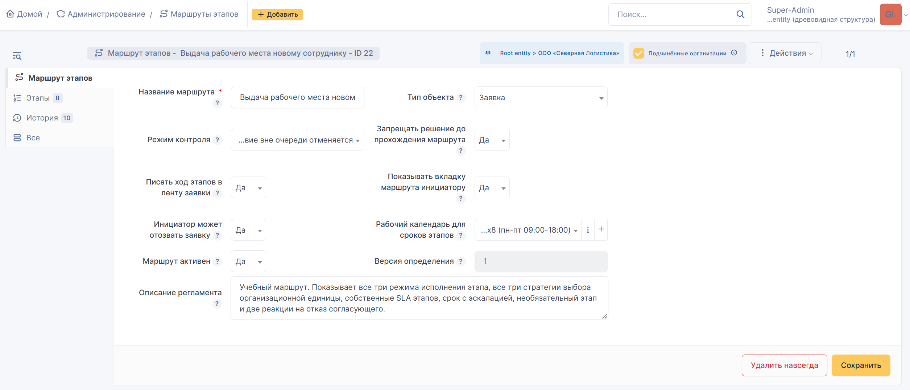
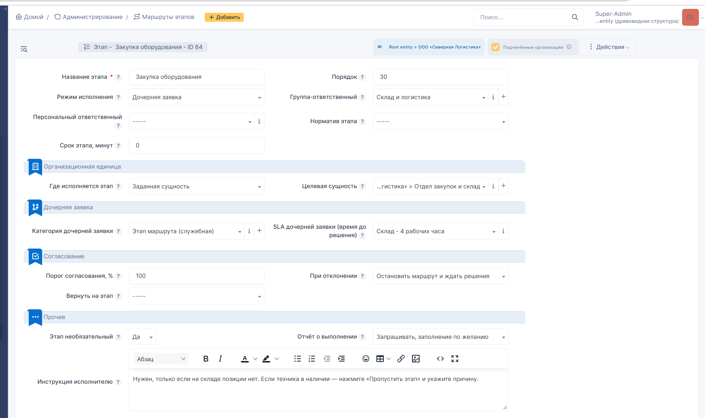
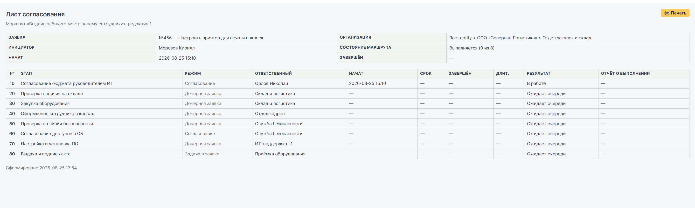

# Tutorial: building a route from scratch

English · **[Русский](TUTORIAL.md)**

Walked through on a real process — provisioning a workstation for a new employee.
By the end you will have a working route that carries a ticket across five
departments on its own and refuses to let it close early.

> **Language notice.** The plugin's interface is Russian only. Menu paths and
> field names below are given in English for readability; on screen they appear
> in Russian. The Russian original of this tutorial is the reference version.

The complete field-by-field reference is the
[administrator manual](itilflow-manual.pdf) *(Russian)*. This document only
covers the path from an empty GLPI to a working process.

---

## What we are building

A production department head orders a workstation for a new hire. The ticket then
has to pass through:

| # | Stage | Who does it | Mode | Deadline |
|---|---|---|---|---|
| 10 | Budget approval | IT director | approval, 100% threshold | — |
| 20 | Stock check | warehouse | child ticket | 4 working hours |
| 30 | Equipment purchase | warehouse | child ticket, **optional** | 4 working hours |
| 40 | HR onboarding | HR | child ticket | 1 working day |
| 50 | Security clearance | security | child ticket | 2 working hours |
| 60 | Access approval | security | approval, 50% threshold | — |
| 70 | Setup and software | IT support | child ticket | 8 working hours |
| 80 | Handover and signed form | equipment desk | task in the ticket | 2 hours |

Numbering in steps of 10 is not decoration. A new stage between the second and
the third gets number 25 without renumbering anything else.

This particular set is deliberate: it exercises all three execution modes, all
three entity strategies, an optional stage, mandatory completion reports,
deadline escalation, and both of the interesting reactions to a rejected
approval.


## Step 0. Verify the installation

**Setup → Plugins** — itilflow must be enabled.

**Setup → Automatic actions** — the stage deadline control task must be listed as
scheduled. Without it, lateness is never flagged.

**Administration → Profiles → [your profile] → Setup** — grant yourself the
**stage routes** right, or the menu entry will not appear.

## Step 1. GLPI reference data

The route defines no reference data of its own; it builds on the stock objects.
Prepare them first, or the stage form will show empty dropdowns.

### Groups

**Administration → Groups** — one group per participant: warehouse, HR, security,
IT support, equipment desk.

Two flags without which nothing works:

- **Can be assigned to tickets** — mandatory. Without it the group never appears
  in the stage dropdown even though it exists in the directory. This is mistake
  number one for everyone configuring a route for the first time.
- **Child entities** (recursive) — for the group that closes a stage in
  task-in-ticket mode. The task lives on the parent ticket, so the group must be
  visible in the parent's entity.

Do not forget to put people in the groups: the **Users** tab inside the group.
Only a member of the named group can close the stage.

### Ticket categories

**Setup → Dropdowns → Ticket categories** — two are needed:

1. **Workstation provisioning for a new employee** — the business rule keys off
   this to start the route.
2. **Route stage** — a service category for the stages' child tickets. Your
   ordinary SLA-assignment and routing rules will work through it.

Make both recursive from the top entity, or they will not be visible in the
departments.

## Step 2. Calendar and service levels

You can skip this at first and come back later — but then stages will have no
deadlines.

### Working calendar

**Setup → Calendars** — create a schedule and add working-time segments, for
example Mon–Fri 09:00 to 18:00.

The calendar settles something important: nights and weekends do not eat the
allowance. A stage opened on Friday at 17:30 with a 4-hour deadline expires on
Monday at 12:30, not overnight on Saturday.

### SLAs

**Setup → Service levels** — first the agreement (SLM), then one SLA per
department inside it with different durations: warehouse 4 hours, HR 1 day, IT 8
hours, security 2 hours. Type: time to resolve (TTR).

**A useful technique: cumulative deadlines.** Define deadlines not as a stage's
duration but as a point measured from the ticket's start: "stage 1 — 30 minutes",
"stage 2 — 50 minutes", "stage 3 — 170 minutes". Then the deadline does not
depend on when someone picked the stage up, and the working calendar shifts it
across nights and weekends by itself.

## Step 3. Create the route

**Administration → Stage routes → Add**

| Field | Set to | Why |
|---|---|---|
| Route name | what the process is called in your company | both the performer and the requester see it |
| Object type | Ticket | cannot be changed once the first routes have run |
| Organisational entity | where the route itself lives | decides whether the route is offered in a business rule's action |
| Visible in child entities | **Yes**, if the rule will live in a sub-entity | otherwise the rule's route dropdown comes up empty |
| Enforcement mode | **Audit** | see below |
| Block resolution until complete | Yes | otherwise the route is a hint with no teeth |
| Write stage progress to the timeline | Yes | the requester follows along and stops calling the desk |
| Show the route tab to the requester | Yes | independent flag: you can log without showing the table |
| Requester may withdraw | Yes | switch off for processes that cannot be cancelled on request — terminations, access revocation |
| Working calendar | your schedule | the stage deadline is counted against it |
| Route active | Yes | an inactive route cannot start on new tickets |

**About the enforcement mode.** For a first rollout choose **Audit**. Everything
is allowed and violations are recorded silently — after a month you will have
real statistics on where the procedure diverges from practice. Then **Warn** for
the transition period. Only once the process has settled, **Strict**. Turning on
strict enforcement over live traffic means a wave of complaints and no insight
into what is actually wrong with the procedure.



## Step 4. Define the stages

The **Stages** tab inside the route → "Add stage".

Each stage minimally needs a name, an order number, an execution mode and an
owner — a group or a person. Below are three stages, one per mode; the rest
follow by analogy.

### An approval stage (10)

| Field | Value |
|---|---|
| Name | Budget approval by the IT director |
| Order | 10 |
| Execution mode | **Approval** |
| Individual owner | IT director |
| Approval threshold, % | 100 |
| On rejection | **Abort the route** |
| Instructions | what exactly to check |

A 100% threshold requires every approver; 50% means a majority suffices. If a
person rather than a group is named, the threshold is meaningless.

There are three reactions to a rejection, and choosing between them is a
substantive decision:

- **Halt** — the route stops, the ticket still cannot be closed, an
  administrator has to intervene. For when a rejection means a problem a human
  must look at.
- **Return to a stage** — a new pass starting from the named stage; the previous
  pass's history is kept in full. For when a rejection means "redo this part".
- **Abort** — the route is cancelled and the ticket can be closed. For when a
  rejection means the whole thing is off.

**If the approver is not known in advance**, set the "who approves" field to
"chosen while the ticket runs" and leave the group and the individual empty.
The stage opens and waits: the route tab shows a form where the ticket's
assignee or a process administrator names the approver and gives a mandatory
reason for the choice. This is how owner approval works when the registry of
resource owners lives outside GLPI.

**The approver needs no special right.** Being named as the approver on the
stage is enough. In GLPI 11 the answer buttons are shown based on `canAnswer()`,
which only checks that assignment and ignores profile rights. The
approve-request / approve-incident right governs something else — who GLPI
offers in its own approver picker — and the route sets the approver itself
without using that picker. Verified on 11.0.8: an approver on the stock
Technician profile answers normally.

### A child-ticket stage (20)

| Field | Value |
|---|---|
| Name | Stock check |
| Order | 20 |
| Execution mode | **Child ticket** |
| Owner group | Warehouse |
| Where the stage runs | **Fixed entity** |
| Target entity | Procurement and warehouse |
| Child ticket category | Route stage |
| Child ticket SLA | Warehouse — 4 working hours |
| Completion report | **Mandatory** |
| Instructions | what to check and what to state in the report |

Three strategies for the organisational entity:

- **Parent's entity** — the stage stays where the ticket is. The whole process
  inside one branch.
- **Fixed entity** — always the one named. A centralised service: one security
  team for the whole group.
- **Group's entity** — derived from the owner group. For when the performer is
  decided by a rule rather than hardcoded.

**Careful.** The owner group must be visible in the target entity. GLPI's data
model does not forbid naming a group from a different entity — the record saves
without a single error, only the dropdown filters. The result is a ticket
assigned to a group that cannot see it, hanging forever. The plugin checks this
itself and halts the route with a clear message instead of creating a dead
ticket. If a route halts the moment a stage opens, this is almost always why:
make the group recursive from a parent entity, or pick a group from the target
entity.

This is a complete stage form — the optional purchase stage in child-ticket
mode:



### A task stage (80)

| Field | Value |
|---|---|
| Name | Handover and signed form |
| Order | 80 |
| Execution mode | **Task in the ticket** |
| Owner group | Equipment desk (recursive) |
| Where the stage runs | Parent's entity |
| Stage deadline, minutes | 120 |
| Effort estimate | planned effort |
| Completion report | Mandatory |

The cheapest mode: the task is created inside the same ticket. For the duration
of the stage the plugin adds the group to the ticket's assignees — otherwise it
would not see the ticket at all — and removes it once the stage closes.

**Stage deadline and effort estimate are different fields.** The estimate is
planned effort; it lands on the task and in effort reports. The stage deadline is
a due point: after how many working minutes the stage counts as late. A task has
no countdown timer and cannot have one — a GLPI task never has its own SLA, which
is a data model limitation. If you need a countdown, use child-ticket mode.

### An optional stage (30)

Set **stage is optional = Yes** and the performer gets a "skip stage" button. A
reason is always mandatory and is written to the ticket timeline as a public
entry.

This is the only way to bypass a step: there is no automatic "skip if the amount
is under N", and conditional stages do not exist.

## Step 5. Configure the start

The route is started by an action on a **stock business rule**, not by a separate
mechanism in the plugin. This is deliberate: the administrator configures the
start with the same criteria as everything else in GLPI, and no second condition
language appears in the system.


**Administration → Rules → Business rules for tickets → Add**

- **Criterion:** Category — is — "Workstation provisioning for a new employee"
- **Action:** Start stage route — assign — your route

You can combine this with any other criteria: ticket type, location, requester's
group, organisational entity.

**Check that the route is active.** An inactive route is still assigned by the
rule, but `Engine::start()` will not start it — silently, with no message. From
the outside this looks like "the rule does not work". Before version 1.3.2 the
form created routes switched off, so on older routes check this first: the route
form, the "route active" field.

**If the rule's route dropdown is empty**, the route lives in a different
organisational entity and is not marked visible in child entities. The action's
dropdown is filtered by the rule's entity: a rule in a sub-entity sees routes of
that sub-entity and of its parents, but only those with child-entity visibility
switched on. This is the most common cause of "the rule does not fire" — the rule
saves without a usable value and silently does nothing.

Rules have an order and a stop-processing flag. If the route does not start when
a ticket is created, check that too: another rule higher in the order may have
pre-empted it.

The route can also be started by hand: on the ticket, the **Stage route** tab →
pick a route → "Start route". Requires the stage routes right.

## Step 6. A service catalogue form

Optional, but a large improvement. Without a form the requester has to pick the
right category themselves — and will get it wrong. With a form the category is
fixed in the destination configuration and there is nothing to get wrong.

**Administration → Forms → Add**

Questions for our process: new employee's full name, position, start date,
workstation type, whether access to the accounting system is needed, additional
requests.

Then the **Destinations** tab, where the form becomes a ticket:

| Destination field | Strategy |
|---|---|
| Title | from the answer to the name question |
| Description | assembled from answers by substitution |
| **Category** | **specific value** — the one the rule keys off |
| Organisational entity | from the form filler |
| Type | service request |

And the **Access** tab — who can see the form.

The chain looks like this:

```
employee fills in the form
    → a ticket is created in their department with the fixed category
        → the business rule sees the category
            → the route starts and the first stage opens
```

The category is the only thing linking the form to the route.

## Step 7. Test it

Create a test ticket in the right category — through the form or directly.

The **Stage route** tab should show the list: the first stage in progress, the
rest queued. The ticket timeline should carry a public entry about the first
stage starting.

Then walk the whole route, logging in as each performer in turn. This matters:
as an administrator you will see neither the visibility limits nor the permission
problems, and every rake will be found in production instead.

What to check along the way:

- **Approval stage.** The approver sees the request in the timeline and can
  answer with the approve/reject buttons. No buttons means the approval rights
  were not granted.
- **Child-ticket stage.** The ticket appeared in the target entity, has an SLA
  with a visible countdown, and the right group assigned. The requester was not
  carried over — for them the stage is internal work. Resolving the child moves
  the route on.
- **Task stage.** The task was created on the parent ticket, the group was added
  to the assignees, and removed after the stage closed.
- **Optional stage.** The skip button is there and will not submit without a
  reason.
- **Mandatory report.** The completion field will not submit empty.
- **Blocked resolution.** Until the route completes, the ticket cannot be
  resolved and no solution can be added. In audit mode the attempt succeeds but
  lands in the violation log under the stage table.
- **Lateness.** A stage with a deadline left open past it is flagged red once the
  automatic action runs, and a private comment appears on the ticket.


## What to look at afterwards

**Approval sheet** — the button in the route tab header. A printable summary of
the run: per stage pass, the owner, a reassignment note with its reason, who
actually closed it, start, due, end, duration, the lateness flag, the performer's
report. This is the document for review and audit.



**Bottleneck report** — **Administration → Stage routes → Bottlenecks**. Per
stage: runs, mean, median, maximum duration, breaches, returns, reassignments.

How to read it: the mean is misleading. A jam shows where the **maximum is far
above the median** — most tickets clear the stage quickly while a subset gets
stuck for a long time, and that subset is what to investigate. Many returns mean
the previous stage's requirements are poorly worded; many reassignments mean the
wrong owner was chosen.

**Violation log** — under the stage table, visible to staff only. Who tried to
bypass the order, how often, and what stopped them. In audit mode every entry
reads "allowed, recorded" — that is the raw material for deciding where the
procedure diverges from practice.

## Common mistakes

| Symptom | Cause | What to do |
|---|---|---|
| The route does not start when a ticket is created | the business rule did not fire: wrong category, rule inactive, or pre-empted by a rule higher in the order | check the rule, its order and the stop-processing flag |
| The group is missing from the stage dropdown | the "can be assigned to tickets" flag is not set | set the flag on the group |
| The performer cannot see the ticket or close the stage | the group is not among the ticket's assignees, or the profile cannot see its groups' tickets | the plugin adds the group itself for the stage; if that did not help, check the "show assigned tickets" right |
| The approver sees no answer buttons | they are not the approver on the current stage, or the stage is already closed | check the ticket's approvals tab; the profile right is irrelevant here |
| The route halted the moment a stage opened | the owner group does not belong to the target entity and is not visible in it | make the group recursive from a parent entity, or pick one from the target |
| The ticket will not close although every stage is done | the route is halted after a rejected approval | Stage route tab → Resume or Abort |
| Two stages share an order number | manual edit of the order | the plugin moved the second to the end and warned; fix the number |
| The requester sees internal detail | the public log is on for a process not meant for the requester | switch off the timeline log and the requester tab for that route |

## Next

The route works — now it has to be rolled out. The order is:

1. A month in **Audit** mode. Restrict nobody, gather statistics.
2. Review the violation log. Where bypassing is routine, the issue is usually not
   discipline but the procedure: a redundant stage, the wrong owner, an
   unrealistic deadline. Edit the route freely — tickets in flight play out their
   own version of the definition and will not break.
3. Switch to **Warn** for the transition period.
4. Once bypasses have all but stopped, **Strict**.

Edit the procedure with confidence at any point: every save increments the route
version, and a ticket records its version at start and plays it through to the
end. A new revision applies only to tickets started after the save.
