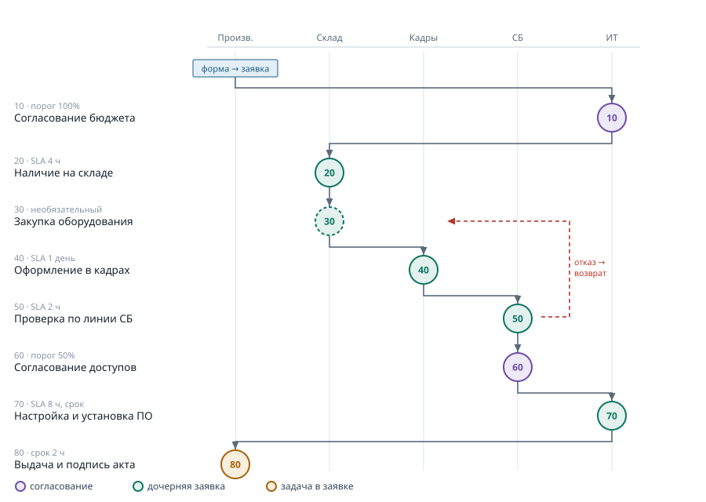

# Обучающий документ: собираем маршрут с нуля

**[English](TUTORIAL.en.md)** · Русский

Разбор на живом процессе — выдаче рабочего места новому сотруднику. К концу
документа у вас будет работающий маршрут, который сам ведёт заявку через пять
подразделений и не даёт закрыть её досрочно.

Полный справочник всех полей — в [руководстве администратора](itilflow-manual.pdf).
Здесь только путь от пустой GLPI до работающего процесса.

---

## Что мы построим

Начальник производственного отдела заказывает рабочее место для нового
сотрудника. Дальше заявка должна пройти:

| № | Этап | Кто делает | Способ | Срок |
|---|---|---|---|---|
| 10 | Согласование бюджета | директор ИТ | согласование, порог 100% | — |
| 20 | Проверка наличия на складе | склад | дочерняя заявка | 4 рабочих часа |
| 30 | Закупка оборудования | склад | дочерняя заявка, **необязательный** | 4 рабочих часа |
| 40 | Оформление в кадрах | отдел кадров | дочерняя заявка | 1 рабочий день |
| 50 | Проверка по линии СБ | служба безопасности | дочерняя заявка | 2 рабочих часа |
| 60 | Согласование доступов | служба безопасности | согласование, порог 50% | — |
| 70 | Настройка и установка ПО | ИТ-поддержка | дочерняя заявка | 8 рабочих часов |
| 80 | Выдача и подпись акта | приёмка оборудования | задача в заявке | 2 часа |

Номера с промежутками по 10 — не прихоть. Новый этап между вторым и третьим
получит номер 25 без перенумерации остальных.

Этот набор выбран не случайно: в нём есть все три режима исполнения, все три
стратегии выбора организационной единицы, необязательный этап, обязательные
отчёты о выполнении, эскалация просрочки и обе интересные реакции на отказ
согласующего.



## Шаг 0. Проверьте установку

**Настройки → Плагины** — itilflow должен быть в состоянии «Включен».

**Настройки → Автоматические действия** — в списке должно быть «Контроль сроков
этапов» со статусом «Запланировано». Без него не будет отмечаться просрочка.

**Администрирование → Профили → [ваш профиль] → Настройки** — выдайте себе право
**«Маршруты этапов»**. Без него не появится пункт меню.

## Шаг 1. Справочники GLPI

Маршрут не заводит своих справочников — он опирается на штатные. Их надо
подготовить первыми, иначе на форме этапа будут пустые выпадающие списки.

### Группы

**Администрирование → Группы** — по одной группе на каждого участника процесса:
склад, кадры, безопасность, ИТ-поддержка, приёмка оборудования.

Два признака, без которых ничего не заработает:

- **«Может быть назначена заявке»** — обязательно. Без него группа не появится
  в выпадающем списке этапа, хотя в справочнике она есть. Это ошибка номер один
  у всех, кто настраивает маршрут впервые.
- **«Дочерние объекты видимы»** (рекурсивная) — для группы, которая закрывает
  этап в режиме «задача в заявке». Задача живёт в родительской заявке, значит
  группа должна быть видна в её организационной единице.

Не забудьте включить людей в группы: **вкладка «Пользователи»** внутри группы.
Этап закроет только участник указанной группы.

### Категории заявок

**Настройки → Списки → Категории заявок** — нужны две:

1. **«Выдача рабочего места новому сотруднику»** — по ней бизнес-правило поймёт,
   что нужно запустить маршрут.
2. **«Этап маршрута»** — служебная, для дочерних заявок этапов. Через неё будут
   работать ваши обычные правила назначения SLA и маршрутизации.

Обе сделайте рекурсивными от верхней единицы, иначе они не будут видны
в подразделениях.

## Шаг 2. Календарь и уровни обслуживания

Этот шаг можно пропустить на старте и вернуться позже — но тогда у этапов
не будет сроков.

### Рабочий календарь

**Настройки → Календари** — создайте график и добавьте сегменты рабочего
времени, например пн–пт с 09:00 до 18:00.

Календарь решает важное: ночь и выходные не съедают норматив. Этап, открытый
в пятницу в 17:30 со сроком 4 часа, истечёт в понедельник в 12:30, а не в ночь
на субботу.

### SLA

**Настройки → Уровни обслуживания** — сначала соглашение (SLM), внутри него
SLA по одному на отдел с разными сроками: склад 4 часа, кадры 1 день, ИТ 8
часов, СБ 2 часа. Тип — «Время до решения» (TTR).

**Приём: накопительные сроки.** Задавайте сроки не как длительность этапа,
а как момент от старта заявки: «этап 1 — 30 минут», «этап 2 — 50 минут»,
«этап 3 — 170 минут». Тогда срок не зависит от того, когда за этап взялись,
а рабочий календарь сам перенесёт дедлайн через ночь и выходные.

## Шаг 3. Создайте маршрут

**Администрирование → Маршруты этапов → Добавить**

| Поле | Что ставим | Почему |
|---|---|---|
| Название маршрута | как процесс называют в компании | видят и исполнитель, и инициатор |
| Тип объекта | Заявка | после запуска первых маршрутов тип менять нельзя |
| Режим контроля | **Журнал** | см. ниже |
| Запрещать решение до прохождения | Да | иначе маршрут превращается в подсказку без принуждения |
| Писать ход этапов в ленту | Да | инициатор следит сам и не звонит в поддержку |
| Показывать вкладку инициатору | Да | независимый флаг: можно вести журнал, но не показывать таблицу |
| Инициатор может отозвать | Да | выключайте для процессов, которые нельзя отменить по желанию — увольнение, отзыв доступов |
| Рабочий календарь | ваш график | по нему считается срок этапа |
| Маршрут активен | Да | неактивный нельзя запустить на новых заявках |

**Про режим контроля.** При первом внедрении ставьте **«Журнал»**. Всё
разрешено, нарушения записываются молча — за месяц вы получите реальную
статистику того, где регламент расходится с практикой. Потом
**«Предупреждение»** на переходный период. И только когда процесс устоялся —
**«Запрет»**. Включать запрет сразу на живом потоке значит получить поток жалоб
и не понять, что в регламенте не так.

## Шаг 4. Опишите этапы

**Вкладка «Этапы»** внутри маршрута → «Добавить этап».

Минимально для каждого этапа нужны: название, порядок, режим исполнения
и ответственный — группа или человек. Разберём три этапа, по одному на каждый
режим; остальные настраиваются по аналогии.

### Этап-согласование (10)

| Поле | Значение |
|---|---|
| Название | Согласование бюджета руководителем ИТ |
| Порядок | 10 |
| Режим исполнения | **Согласование** |
| Персональный ответственный | директор ИТ |
| Порог согласования, % | 100 |
| При отклонении | **Прервать маршрут** |
| Инструкция исполнителю | что именно проверить |

Порог 100% — нужны все согласующие; 50% — достаточно большинства. Если указан
человек, а не группа, порог не имеет смысла.

Реакции на отказ три, и выбор между ними — содержательное решение:

- **Остановить** — маршрут встаёт, заявку по-прежнему нельзя закрыть, нужно
  решение администратора. Когда отказ означает проблему, которую должен
  разобрать человек.
- **Вернуться на этап** — новый проход с указанного этапа, история прошлого
  прохода сохраняется целиком. Когда отказ означает «переделайте вот это».
- **Прервать** — маршрут отменяется, заявку можно закрывать. Когда отказ
  означает отмену всей затеи.

**Обязательно проверьте права согласующего.** У профиля Technician нет флагов
«Согласовать запрос» и «Согласовать инцидент» — он умеет только *запрашивать*
согласование. Такой согласующий увидит запрос и не сможет ответить, маршрут
встанет намертво. Плагин предупредит при сохранении этапа, но право нужно выдать
вручную: **Администрирование → Профили → [профиль] → Помощь**.

### Этап-дочерняя заявка (20)

| Поле | Значение |
|---|---|
| Название | Проверка наличия на складе |
| Порядок | 20 |
| Режим исполнения | **Дочерняя заявка** |
| Группа-ответственный | Склад и логистика |
| Где исполняется этап | **Заданная сущность** |
| Целевая сущность | Отдел закупок и склад |
| Категория дочерней заявки | Этап маршрута |
| SLA дочерней заявки | Склад — 4 рабочих часа |
| Отчёт о выполнении | **Обязательно** |
| Инструкция исполнителю | что проверить и что указать в отчёте |

Три стратегии выбора организационной единицы:

- **Сущность родительской** — этап остаётся там же, где заявка. Весь процесс
  внутри одного филиала.
- **Заданная сущность** — всегда в указанной. Централизованная служба: одна
  служба ИБ на весь холдинг.
- **Сущность группы** — вычисляется от группы-исполнителя. Когда исполнитель
  определяется правилом, а не жёстко.

**Внимание.** Группа-ответственный должна быть видима в целевой сущности.
Модель данных GLPI не запрещает назначить группу чужой единицы — запись
создастся без единой ошибки, фильтрует только выпадающий список. Результат:
заявка, назначенная на группу, которая её не видит, висит навсегда. Плагин
проверяет это сам и останавливает маршрут с понятным сообщением вместо создания
«мёртвой» заявки. Если маршрут встал сразу при открытии этапа — причина почти
всегда здесь: сделайте группу рекурсивной из вышестоящей единицы или выберите
группу из целевой.

### Этап-задача (80)

| Поле | Значение |
|---|---|
| Название | Выдача и подпись акта |
| Порядок | 80 |
| Режим исполнения | **Задача в заявке** |
| Группа-ответственный | Приёмка оборудования (рекурсивная) |
| Где исполняется этап | Сущность родительской |
| Срок этапа, минут | 120 |
| Норматив этапа | плановая трудоёмкость |
| Отчёт о выполнении | Обязательно |

Самый дешёвый режим: задача создаётся внутри той же заявки. На время этапа
плагин сам добавляет группу в исполнители заявки — иначе она бы её просто
не увидела — и снимает после закрытия этапа.

**«Срок этапа» и «Норматив этапа» — разные поля.** Норматив это плановая
трудоёмкость, она попадает в задачу и в отчёты по трудозатратам. Срок этапа это
дедлайн: через сколько минут рабочего времени этап считается просроченным.
Отдельного таймера с обратным отсчётом у задачи нет и быть не может — у задачи
в GLPI своего SLA не бывает, это ограничение модели данных. Нужен обратный
отсчёт — берите режим «дочерняя заявка».

### Необязательный этап (30)

Поставьте **«Этап необязательный» = Да** — у исполнителя появится кнопка
«Пропустить этап». Причина пропуска обязательна всегда и попадает в ленту
заявки публичной записью.

Это единственный способ обойти шаг: автоматического «пропустить, если сумма
меньше N» в плагине нет, условных этапов не существует.

## Шаг 5. Настройте запуск

Маршрут запускается действием **штатного бизнес-правила**, а не отдельным
механизмом плагина. Это сделано намеренно: администратор настраивает старт теми
же критериями, что и всё остальное в GLPI, и второго языка условий в системе
не появляется.


**Администрирование → Правила → Бизнес-правила для заявок → Добавить**

- **Условие:** Категория — равно — «Выдача рабочего места новому сотруднику»
- **Действие:** Запустить маршрут этапов — назначить — ваш маршрут

Можно комбинировать с любыми другими критериями: тип заявки, местоположение,
группа инициатора, организационная единица.

У правил есть порядок и признак «остановить обработку». Если маршрут
не запускается при создании заявки — проверьте в первую очередь это: правило
могло перекрыть другое, стоящее выше по порядку.

Маршрут можно запустить и вручную: на заявке вкладка **«Маршрут этапов»** →
выбрать маршрут → «Запустить маршрут». Нужно право «Маршруты этапов».

## Шаг 6. Форма каталога услуг

Необязательный, но сильно улучшающий шаг. Без формы инициатор должен сам выбрать
правильную категорию — и ошибётся. С формой категория задана жёстко в настройках
назначения, и ошибиться нечем.

**Администрирование → Формы → Добавить**

Вопросы для нашего процесса: ФИО нового сотрудника, должность, дата выхода,
тип рабочего места, требуется ли доступ к учётной системе, дополнительные
пожелания.

Затем **вкладка «Назначения»** — там форма превращается в заявку:

| Поле назначения | Стратегия |
|---|---|
| Заголовок | из ответа на вопрос о ФИО |
| Описание | собрать из ответов подстановкой |
| **Категория** | **конкретное значение** — та, по которой срабатывает правило |
| Организационная единица | от заполнившего форму |
| Тип | запрос на обслуживание |

И **вкладка «Доступ»** — кому форма видна.

Цепочка получается такая:

```
сотрудник заполняет форму
    → создаётся заявка в его отделе с заданной категорией
        → бизнес-правило видит категорию
            → маршрут запущен, открыт первый этап
```

Категория — единственное, что связывает форму с маршрутом.

## Шаг 7. Проверьте

Создайте тестовую заявку нужной категории — через форму или напрямую.

На вкладке **«Маршрут этапов»** должен появиться список: первый этап
в состоянии «Выполняется», остальные — «Ожидает очереди». В ленте заявки —
публичная запись о начале первого этапа.

Дальше пройдите маршрут целиком, входя в систему от имени каждого исполнителя.
Это важно: под администратором вы не увидите ни ограничений видимости, ни
проблем с правами, и все грабли обнаружатся уже в проде.

Что проверить по ходу:

- **Этап-согласование.** Согласующий видит запрос в ленте и может ответить
  кнопками «Одобрить» / «Отклонить». Если кнопок нет — не выданы права
  согласования.
- **Этап-дочерняя заявка.** Заявка появилась в целевой сущности, у неё
  назначен SLA и виден обратный отсчёт, назначена нужная группа. Инициатор
  на неё не перенесён — для него этап это внутренняя работа. Перевод дочерней
  в «Решена» двигает маршрут дальше.
- **Этап-задача.** Задача создана в родительской заявке, группа добавлена
  в исполнители, после закрытия этапа снята.
- **Необязательный этап.** Кнопка «Пропустить» есть, без причины не отправляется.
- **Обязательный отчёт.** Пустым поле «Что сделано» не отправляется.
- **Запрет решения.** Пока маршрут не пройден, заявку нельзя перевести
  в «Решена» и нельзя добавить решение. В режиме «Журнал» попытка пройдёт,
  но окажется в журнале нарушений под таблицей этапов.
- **Просрочка.** Этап со сроком, оставленный открытым дольше срока, будет
  помечен красным после срабатывания автоматического действия, и в заявку
  придёт личный комментарий.

## Что смотреть в результате

**Лист согласования** — кнопка в шапке вкладки маршрута. Печатная сводка
прохождения: по каждому проходу этапа ответственный, отметка о передаче
с причиной, кто фактически закрыл, начало, срок, окончание, длительность,
признак просрочки, отчёт исполнителя. Это документ для разбора и для аудита.

**Отчёт по узким местам** — **Администрирование → Маршруты этапов → Узкие
места**. По этапам: прохождения, средняя, медиана, максимум длительности, число
просрочек, возвратов и передач.

Как его читать: средняя обманчива. Затор виден там, где **максимум сильно больше
медианы** — значит большинство заявок проходит этап быстро, а часть застревает
надолго, и разбирать надо именно эту часть. Много возвратов означает плохо
сформулированные требования к предыдущему этапу; много передач — неверно
выбранного ответственного.

**Журнал нарушений** — под таблицей этапов, виден только сотрудникам. Кто
и сколько раз пытался обойти порядок и что именно ему помешало. В режиме
«Журнал» все записи будут со статусом «разрешено, записано» — это и есть
материал для решения, где регламент расходится с практикой.

## Частые ошибки

| Симптом | Причина | Что делать |
|---|---|---|
| Маршрут не запускается при создании заявки | бизнес-правило не сработало: не та категория, правило неактивно или его перекрыло правило выше по порядку | проверьте правило, его порядок и признак «остановить обработку» |
| Группы нет в выпадающем списке этапа | не стоит признак «Может быть назначена заявке» | поставьте признак в карточке группы |
| Исполнитель не видит заявку и не может закрыть этап | группа не входит в исполнители заявки, либо профиль не видит заявки своих групп | на время этапа плагин добавляет группу сам; если не помогло — проверьте право «Показывать назначенные заявки» |
| Согласующий видит запрос, но не может ответить | в профиле нет права «Согласовать запрос / инцидент» | Администрирование → Профили → [профиль] → Помощь |
| Маршрут остановился сразу при открытии этапа | группа-ответственный не принадлежит целевой единице и не видна в ней | сделайте группу рекурсивной из вышестоящей или выберите группу из целевой |
| Заявку не удаётся закрыть, хотя все этапы пройдены | маршрут в состоянии «Остановлен» после отказа согласующего | вкладка «Маршрут этапов» → Возобновить или Прервать |
| Два этапа с одинаковым номером | ручная правка порядка | плагин сдвинул второй в конец и предупредил; поправьте номер |
| Инициатор видит внутренние подробности | включён публичный журнал у процесса, не предназначенного для показа заявителю | выключите «Писать ход этапов в ленту» и «Показывать вкладку инициатору» |

## Дальше

Маршрут работает — теперь его надо внедрить. Порядок такой:

1. Месяц в режиме **«Журнал»**. Никого не ограничиваем, собираем статистику.
2. Разбираем журнал нарушений. Там, где обход регулярен, вопрос обычно
   не в дисциплине, а в регламенте: этап лишний, ответственный не тот, срок
   нереальный. Правьте маршрут — заявки в работе доигрывают свою версию
   определения и не сломаются.
3. Переключаем на **«Предупреждение»** на переходный период.
4. Когда обходов почти не осталось — **«Запрет»**.

Правьте регламент спокойно на любом этапе: каждое сохранение маршрута
увеличивает номер версии, заявка запоминает версию на старте и доигрывает
её до конца. Новая редакция применится к заявкам, запущенным после сохранения.
